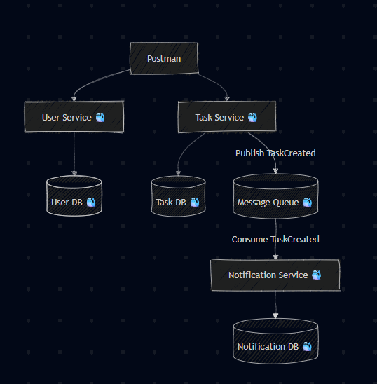

# Event-Driven Node.js Microservices with Docker

This project is a demonstration of a scalable, event-driven microservices architecture built with Node.js, Express, MongoDB, and RabbitMQ. The entire application stack is containerized using Docker and orchestrated with Docker Compose for easy setup and development.



---

## Table of Contents

- [Architecture Overview](#architecture-overview)
- [Project Structure](#project-structure)
- [Prerequisites](#prerequisites)
- [Getting Started](#getting-started)
- [Services & Endpoints](#services--endpoints)
- [Testing with Postman](#testing-with-postman)
- [How It Works: The Event Flow](#how-it-works-the-event-flow)
- [Future Improvements](#future-improvements)

---

## Architecture Overview

The application is composed of several independent services that communicate with each other asynchronously via a message queue, following a robust microservices pattern.

- **User Service**: A RESTful API responsible for all user-related operations (CRUD). It has its own connection to the MongoDB database.
- **Task Service**: A RESTful API for all task-related operations. When a new task is created, it saves the task to MongoDB and publishes a `TaskCreated` event to the message queue.
- **Notification Service**: A background service that acts as a "consumer." It listens for `TaskCreated` events from the message queue and simulates sending a notification when a message is received.
- **MongoDB**: A NoSQL database used as the persistent data store for both the User and Task services. It runs in its own Docker container.
- **RabbitMQ**: A message broker that decouples the services. It allows the Task Service to send events without needing to know which service (or how many services) will consume them.
- **Postman**: Used as the client to interact with the exposed API endpoints.

---

## Project Structure

The project is organized into separate directories for each microservice, promoting clean separation of concerns.

```
.
├── docker-compose.yml
├── notification-service/
│   ├── Dockerfile
│   ├── index.js
│   └── package.json
├── task-service/
│   ├── Dockerfile
│   ├── index.js
│   └── package.json
└── user-service/
    ├── Dockerfile
    ├── index.js
    └── package.json
```

---

## Prerequisites

Before you begin, ensure you have the following installed on your system:

- [Docker](https://www.docker.com/)
- Docker Compose (usually included with Docker Desktop)

---

## Getting Started

Setting up and running the entire application stack is streamlined with Docker Compose.

### Clone the Repository

```bash
git clone https://github.com/AbQaadir/node-micro-services.git
cd node-micro
```

### Build and Run the Containers

From the root directory of the project (where `docker-compose.yml` is located), run:

```bash
docker-compose up --build
```

- The `--build` flag will build the Docker images for each service for the first time or when you make changes to their Dockerfile or source code.
- Docker Compose will start all five containers (`user-service`, `task-service`, `notification-service`, `mongodb`, `rabbitmq`) and connect them to a shared network.
- You should see logs from all services in your terminal, indicating that they have started and connected successfully.

---

## Services & Endpoints

| Service                  | Local Port | Description                                            |
| ------------------------ | ---------- | ------------------------------------------------------ |
| **User Service**         | `3001`     | API for managing users.                                |
| **Task Service**         | `3002`     | API for managing tasks.                                |
| **Notification Service** | `3003`     | Health check endpoint for the background service.      |
| **MongoDB**              | `27017`    | Database port for connecting with tools like Compass.  |
| **RabbitMQ Management**  | `15672`    | Web UI to monitor queues and messages. (`guest/guest`) |

---

## Testing with Postman

Postman collections are provided in the repository to easily test the `user-service` and `task-service` APIs.

1. Open Postman.
2. Click **File > Import** and select the following files:
   - `user_service.postman_collection.json`
   - `task_service.postman_collection.json`
3. The collections will appear in your Postman workspace, ready to be used to send requests to:
   - `http://localhost:3001` (User Service)
   - `http://localhost:3002` (Task Service)

---

## How It Works: The Event Flow

This project demonstrates a decoupled, asynchronous workflow:

1. A client (Postman) sends a `POST` request to `http://localhost:3002/tasks` to create a new task.
2. The Task Service receives the request, validates the data, and saves the new task to the MongoDB database.
3. After a successful save, the Task Service publishes a message containing the new task's data to the `TaskCreated` queue in RabbitMQ, then returns a `201 Created` response to the client.
4. The Notification Service, which is independently running and listening to the `TaskCreated` queue, immediately receives the message.
5. The Notification Service processes the message and logs a confirmation to the console, simulating the sending of a user notification (e.g., an email or push notification).

This architecture ensures that the task creation process is fast and is not blocked by the notification process. If the Notification Service were to fail, tasks could still be created without interruption.
